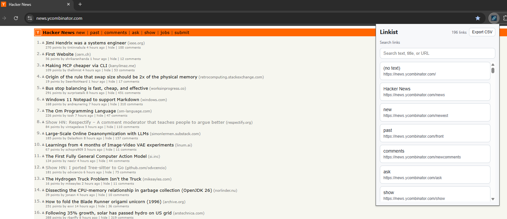

# Linkist

Linkist is a Chrome extension (Manifest V3) that scans the active webpage and lists all unique anchor links (`<a href>`).

## Preview



## Features

- Scans links from the current active tab
- Includes anchor links only (`a[href]`)
- Deduplicates links by normalized absolute URL
- Preserves page DOM order
- Opens selected links in a new tab from the popup
- Handles restricted pages gracefully (for example `chrome://` pages)

## Tech Stack

- Vanilla HTML/CSS/JavaScript
- Chrome Extensions Manifest V3
- No build step required

## Project Structure

```text
.
|-- manifest.json
|-- popup.html
|-- popup.css
|-- popup.js
`-- README.md
```

## Getting Started

1. Open Chrome and go to `chrome://extensions`.
2. Enable **Developer mode**.
3. Click **Load unpacked**.
4. Select this project folder.
5. Open any standard `http` or `https` webpage.
6. Click the Linkist extension icon to view detected links.

## Permissions

`manifest.json` currently uses:

- `activeTab`: access the active tab after user interaction
- `scripting`: execute extraction logic in page context
- `tabs`: open selected links in new tabs

## Current MVP Behavior

- The popup shows a loading state while scanning.
- If no links are found, it shows an empty state.
- If the page is restricted, it shows an error state.
- Clicking a link row opens that URL in a new tab.

## Development Notes

- This is a minimal greenfield implementation intended for quick iteration.
- Potential next enhancements:
  - Copy all URLs
  - Export CSV
  - Filtering and search in popup
  - Side panel or full-page results view
